Bagian 1: Membuat API dengan JSON menggunakan Node.js

1. Instalasi Node.js dan Express.js
   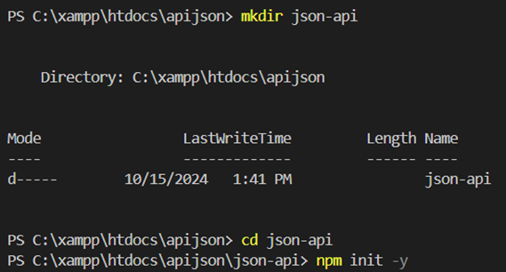
   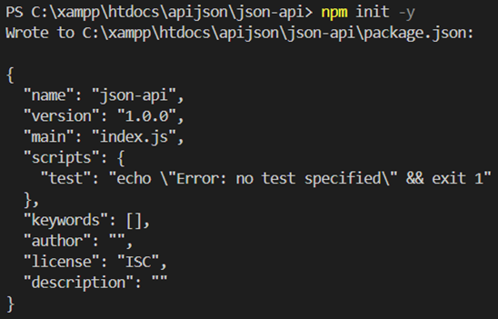
   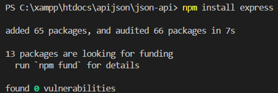

2. Membuat Server Express.js
   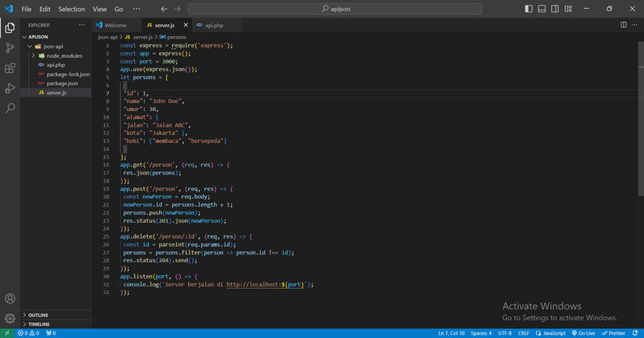

3. Menjalankan Server
   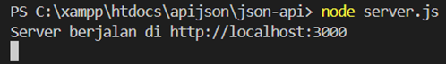
   

4. Mengakses API menggunakan Postman untuk mengakses endpoint (GET, POST, DELETE)
   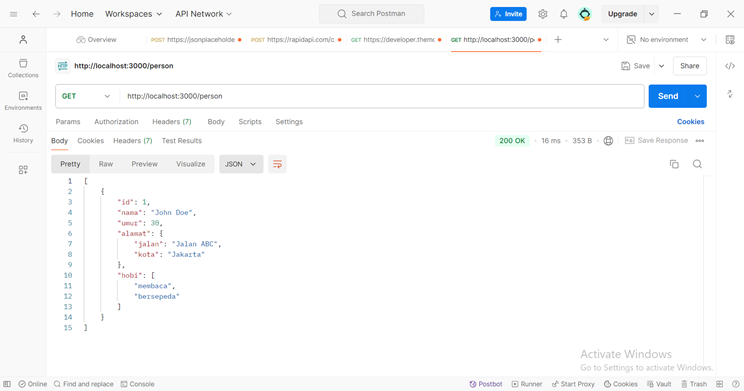
   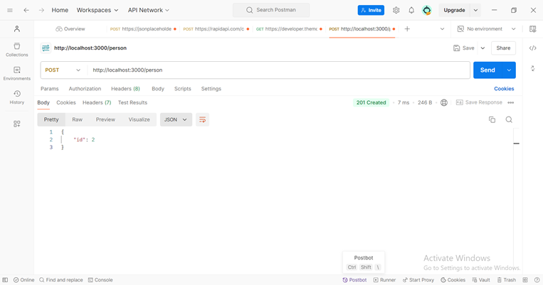
   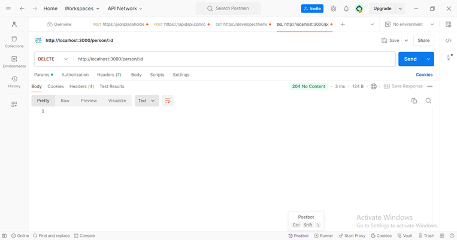

Bagian 2: Membuat API dengan JSON menggunakan PHP

1. Instalasi PHP dan Server Web
   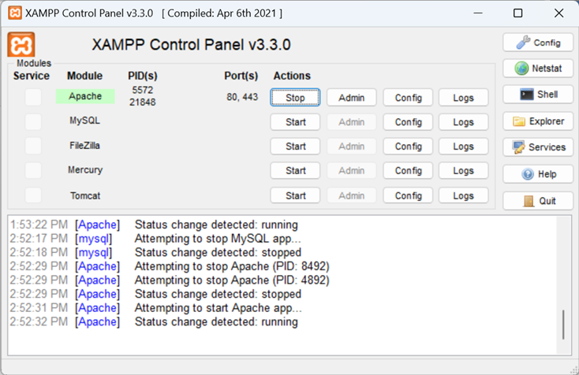

2. Membuat File API
   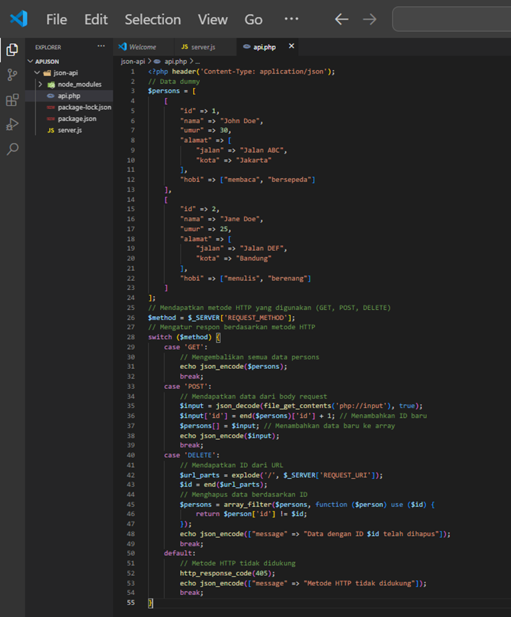

3. Menjalankan Server
   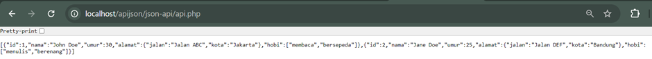

4. Mengakses API
   GET
   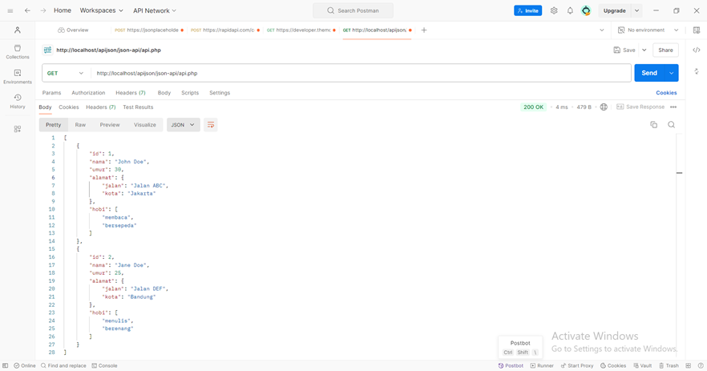

POST
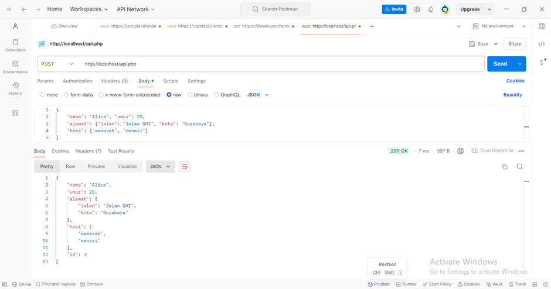

DELETE
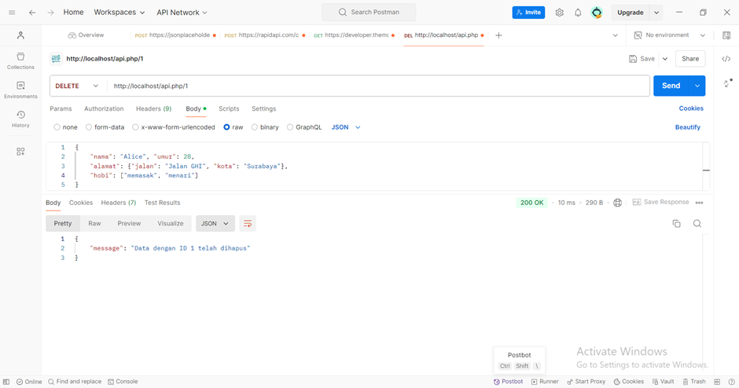

Bagian 3: Membuat API dengan XML menggunakan PHP

1. Instalasi PHP dan Server Web
   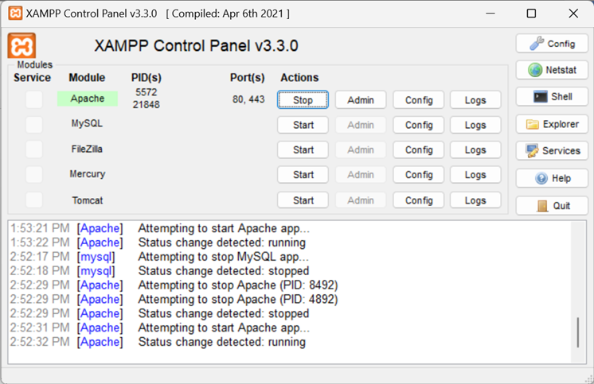

2. Membuat Endpoint XML
   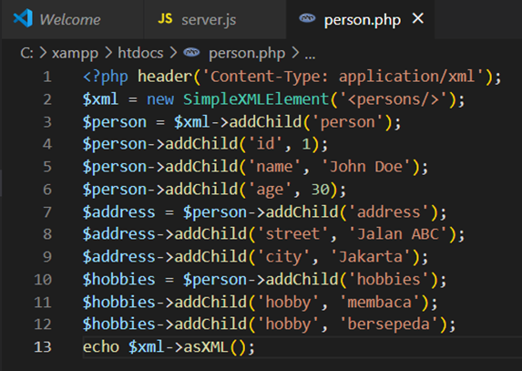

3. Menjalankan Server
   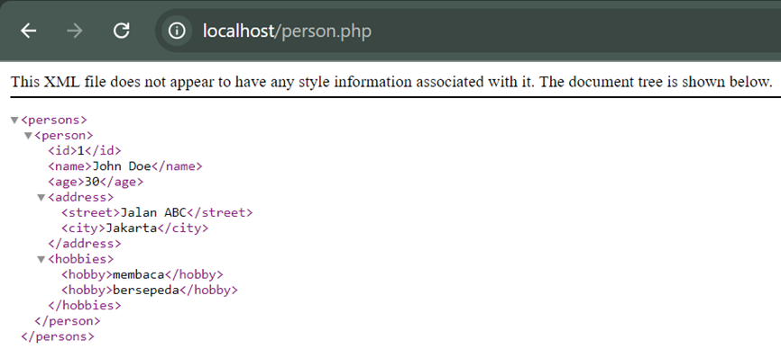

4. Mengakses API
   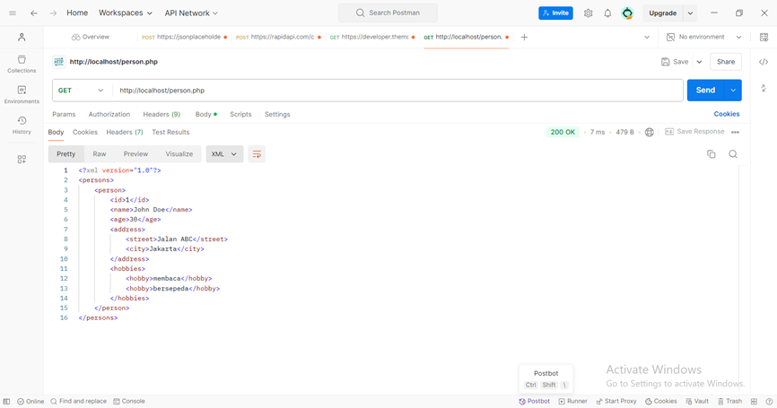