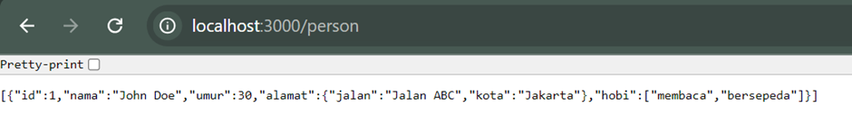

Bagian 1: Membuat API dengan JSON menggunakan Node.js
1. Instalasi Node.js dan Express.js

2. Membuat Server Express.js

3. Menjalankan Server

4. Mengakses API menggunakan Postman untuk mengakses endpoint (GET, POST, DELETE)

Bagian 2: Membuat API dengan JSON menggunakan PHP
1. Instalasi PHP dan Server Web

2. Membuat File API

3. Menjalankan Server

4. Mengakses API
GET

POST

DELETE

Bagian 3: Membuat API dengan XML menggunakan PHP
1. Instalasi PHP dan Server Web

2. Membuat Endpoint XML

3. Menjalankan Server

4. Mengakses API